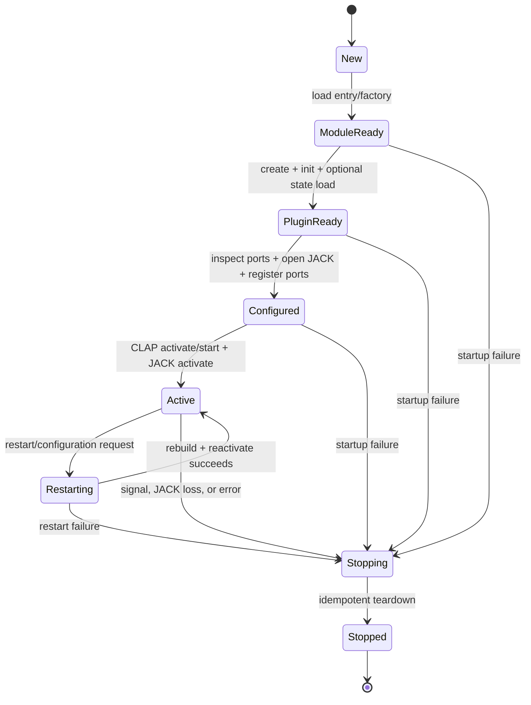
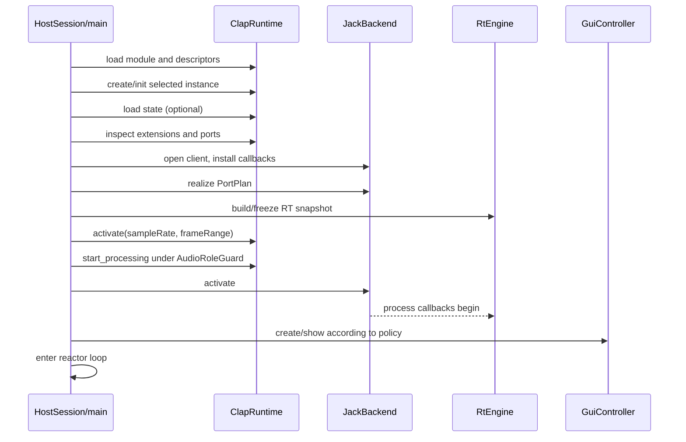

# Standalone CLAP/JACK Plugin Host — High-Level Software Design

**Status:** Draft for review  
**Working product/binary name:** `pluginhost`  
**Companion document:** [`REQUIREMENTS.md`](REQUIREMENTS.md)  
**Initial implementation:** Linux, JACK, CLAP 1.2.10, Nim 2.x

## 1. Purpose and scope

`REQUIREMENTS.md` defines product behavior, constraints, and acceptance criteria. This document defines the proposed software structure: component boundaries, dependency direction, thread and memory models, state transitions, data flow, extension seams, and verification strategy.

This is a high-level design rather than a complete implementation specification. Public and internal APIs may evolve during implementation, but changes must preserve the invariants in this document or be recorded as architecture decisions.

The design intentionally balances two goals:

1. Keep the first Linux/JACK/CLAP implementation small and understandable.
2. Isolate external APIs and volatile platform details so future audio backends, window systems, CLAP versions, or plugin formats can be added without rewriting the application core.

Flexibility does **not** mean implementing unused frameworks now. Abstractions are introduced only at external boundaries or where they make real-time code testable.

## 2. Architectural drivers

In priority order:

1. **Real-time safety:** the JACK process path must be bounded, allocation-free, lock-free, and free of blocking or diagnostic I/O.
2. **CLAP correctness:** lifecycle, extension, thread, event, and pointer-lifetime rules must be explicit and enforceable.
3. **Safe ownership:** no plugin, GUI, port, or FFI object may outlive the library or service that owns it.
4. **Main-thread responsiveness:** plugin GUI, timers, POSIX FDs, host callbacks, and signals share one event-driven main loop.
5. **Failure isolation within the process:** partial initialization and ordinary API failures must clean up deterministically, while acknowledging that an in-process plugin can still crash the process.
6. **Testability:** lifecycle, port mapping, event conversion, state streams, and queue behavior must be testable without a physical audio device or third-party plugin.
7. **Replaceable boundaries:** CLAP, JACK, X11, session D-Bus, Linux event APIs, and filesystem behavior must be contained in adapters.
8. **Minimal deployment:** avoid a general GUI toolkit and unrelated host functionality in the initial release.

## 3. Architecture principles

### 3.1 Split control and real-time planes

The process is divided into two cooperating planes:

- The **control plane** runs on the main thread. It owns lifecycle, allocation, discovery, state files, GUI, timers, registered FDs, logging, and cleanup.
- The **real-time plane** runs only while servicing JACK. It maps current JACK buffers/events to a prebuilt CLAP processing view and returns output without allocation or blocking.

Communication crosses the boundary only through atomics and fixed-capacity queues. Control-plane objects are never manipulated directly by the process callback.

### 3.2 Ports and adapters at external boundaries

The application coordinator depends on narrow capabilities rather than raw JACK, CLAP DSO, X11, D-Bus, or Linux calls. Concrete adapters implement those capabilities.

The architecture does not force CLAP concepts into an overly generic plugin model. CLAP-specific lifecycle and extensions remain in the CLAP package. Shared abstractions cover only concepts the application actually needs: a loadable processor, a port plan, a real-time process endpoint, state capability, and GUI capability.

### 3.3 Explicit state machines over boolean combinations

Session, plugin, audio backend, and GUI states are represented as enums with checked transitions. Operations such as `activate`, `restart`, `show`, and `shutdown` must be idempotent or reject invalid states clearly.

### 3.4 Explicit ownership and cleanup

Foreign resources use explicit `open`/`close` or `init`/`deinit` pairs. Cleanup methods are idempotent. The design does not rely on Nim finalizer order for JACK clients, dynamic libraries, X11/D-Bus resources, file descriptors, or state files.

### 3.5 Immutable configuration and snapshots

Parsed command configuration is immutable. Port descriptions are built as immutable snapshots while the plugin is deactivated. Real-time code receives a frozen snapshot whose storage remains valid until JACK has been quiesced.

### 3.6 Dependency direction

High-level application policy must not import raw FFI modules. Dependencies point from adapters toward stable application/domain types, while the executable composition root selects concrete adapters.

No global service locator is used. Dependencies are passed explicitly.

## 4. System context

```mermaid
flowchart LR
    User[User / session manager]
    Midi[JACK MIDI clients]
    Audio[JACK audio clients]
    Server[JACK / PipeWire-JACK server]
    Plugin[Native CLAP plugin]
    Display[X11 / XWayland display]
    Bus[Session D-Bus / StatusNotifierWatcher]
    FS[Plugin and state files]

    User -->|CLI and POSIX signals| Host[pluginhost process]
    Host <-->|client API| Server
    Midi <-->|MIDI ports| Server
    Audio <-->|audio ports| Server
    Host <-->|CLAP ABI calls and callbacks| Plugin
    Host <-->|window and events| Display
    Host <-->|StatusNotifierItem| Bus
    Host <-->|load, scan, state| FS

Trust boundaries:

- JACK, X11, session D-Bus, and filesystem data are external inputs and must be validated.
- Signal handlers and foreign callbacks can run asynchronously and must not touch main-thread-owned resources directly.

## 5. Top-level component model

```mermaid
flowchart TB
    Main[Composition root / CLI]
    Session[HostSession coordinator]
    Reactor[MainReactor]
    Clap[ClapRuntime]
    Jack[JackBackend]
    Gui[GuiController]
    Tray[TrayController]
    State[StateStore]
    Discovery[PluginDiscovery]
    RT[RtEngine]
    Mail[RtMailbox and metrics]

    Main --> Session
    Session --> Reactor
    Session --> Clap
    Session --> Jack
    Session --> Gui
    Session --> Tray
    Session --> State
    Main --> Discovery

    Jack -->|static C callback| RT
    RT -->|direct process call| Clap
    Clap -->|atomic requests / bounded records| Mail
    Jack --> Mail
    Mail -->|drained by main thread| Session
    Reactor -->|timers, FDs, signals| Session
    Gui --> Reactor
    Tray --> Reactor
    Clap --> Reactor

    FFI1[CLAP FFI] --> Clap
    FFI2[JACK FFI] --> Jack
    FFI3[X11 FFI] --> Gui
    FFI4[D-Bus FFI] --> Tray
    FFI5[POSIX FFI] --> Reactor
```

### 5.1 Composition root and CLI

Responsibilities:

- Parse arguments into immutable `RunConfig`, `ListConfig`, or `ScanConfig` values.
- Validate mutually exclusive options and paths.
- Construct concrete Linux/JACK/CLAP/X11/D-Bus adapters.
- Map typed failures to diagnostics and exit statuses.
- Ensure the top-level cleanup path runs exactly once.

The CLI layer contains no plugin lifecycle or process logic.

### 5.2 `HostSession` coordinator
`HostSession` is the control-plane owner for one running plugin instance. It:

- Executes startup, restart, and shutdown state transitions.
- Owns the plugin module/instance, JACK backend, GUI controller, optional tray
  controller, reactor registrations, state service, mailboxes, and metrics.
- Drains requests generated by CLAP callbacks or JACK notifications.
- Applies policy such as headless fallback, required-GUI failure, save-on-exit, and exit-status selection.
- Ensures JACK is quiescent before changing or releasing real-time snapshots.

`HostSession` does not parse CLI text, call raw FFI directly, or perform sample processing itself.

Increment 7 makes this coordinator the public headless runtime owner. It constructs the
signal source/reactor before plugin or JACK work, moves one `InternalAudioSlice` into the
session, services bounded control snapshots and CLAP requests, and releases PID, reactor,
and signal-mask resources after audio/plugin/JACK teardown.

Increment 8A makes `HostSession` own one fixed-capacity `PluginServiceRegistry` before
plugin creation. Its stable callback table is borrowed by `ClapHostBridge`; registrations
map CLAP timer IDs and POSIX FDs to reactor generation tokens. Shutdown first quiesces
JACK/CLAP processing, then removes service registrations, then destroys the plugin.

### 5.3 `ClapRuntime`

This package is split into several focused components:

- **`ClapModule`** owns the dynamic library, `clap_entry`, successful entry initialization, and plugin factory.
- **`ClapCatalog`** validates and exposes copied descriptor metadata for list/selection operations.
- **`ClapInstance`** owns one initialized plugin and its cached extension pointers.
- **`ClapLifecycle`** checks and executes legal plugin state transitions.
- **`ClapHostBridge`** owns the stable `clap_host` object and all host extension vtables exposed to the plugin.
- **`ClapMainThreadServices`** is a narrow stable callback table that lets host timer/FD vtables reach application-owned reactor policy without importing application modules.
- **`ClapPortInspector`** builds audio/note port descriptions while deactivated.
- **`ClapEventBridge`** translates JACK MIDI and CLAP events using preallocated storage.
- **`ClapStateCodec`** adapts bounded file streams to CLAP stream callbacks.

Raw CLAP pointers do not escape this package except for a prevalidated real-time endpoint held by `RtEngine`.

### 5.4 `JackBackend`

Responsibilities:

- Explicitly open a checked, move-only `JackApi` DSO/procedure-table owner only for JACK-backed work.
- Keep every borrowed JACK function pointer valid until the client is closed and callbacks are quiescent.
- Open and close a JACK client.
- Register process, shutdown, buffer-size, sample-rate, xrun, freewheel, and required latency callbacks before activation.
- Query sample rate, maximum/current block size, actual client name, and name limits.
- Materialize a `PortPlan` as JACK audio and MIDI ports transactionally.
- Activate, deactivate, and prove callback quiescence.
- Supply current JACK buffers to `RtEngine` in the process trampoline.
- Reflect CLAP latency in JACK ranges.
- Convert JACK status and callback notifications into typed control-plane events.

Only this package imports the raw JACK FFI/API layers. Importing those layers has no
module-initialization side effect; `openJackApi` is the explicit runtime load point.

The Increment 4B backend is internal/test-only. It has explicit `Closed`, `Open`,
`Configured`, and `Active` states and owns one stable shared callback context. JACK
deactivation is the process-callback quiescence boundary; the immutable map remains
alive afterward. `jack_client_close` is the all-callback quiescence boundary, after
which callback storage may be freed and the JACK DSO may be unloaded. Increment 5's internal `InternalAudioSlice` composes this backend with `ClapInstance` and owns the preallocated CLAP audio process view. Increment 6 extends that same owner with `ClapEventBridge`; Increment 7 moves it unchanged into the public `HostSession`.

Increment 4C/5 prove the audio boundary against a private PipeWire-JACK core at a fixed 48 kHz/64-frame quantum. A separate process owns the observing JACK client, validates realized audio/MIDI ports and deterministic audio samples, witnesses continued server cycles after backend deactivation and close, and verifies that client-close removes every host port. Approved Increment 6B adds an acyclic source-host-capture graph through two independent peer JACK clients, proving exact live multi-port MIDI/SysEx offsets, repeated activation quiescence, port removal, and callback instrumentation through the CLAP event path.

### 5.5 `RtEngine`

`RtEngine` is a fixed-layout, explicitly owned structure reachable from the JACK callback through an opaque pointer. It contains only real-time-safe data:

- Frozen audio and note port maps.
- Current JACK audio and MIDI buffer pointers, valid only during a cycle.
- A backend-neutral `RtMidiIo` table of prevalidated POD callback adapters.
- A prevalidated endpoint pointer/function used by the active CLAP process adapter.
- Atomic request, error, generation, and metric fields.

It contains no managed strings, sequences, tables, closures, exceptions, GUI objects, dynamic-library handles, or ownership of foreign resources.

The 4B skeleton implements fixed audio-buffer pointer arrays, a fake process mode, and bounded silence/copy/deterministic loops. Increment 5 adds the CLAP audio adapter with preallocated grouped descriptors and channel-pointer storage. Increment 6A adds backend-neutral MIDI buffer binding while `ClapEventBridge`, adjacent to the stable CLAP process context, owns its fixed event slots and merge heap.

The JACK callback reaches it through a non-capturing `{.cdecl.}` trampoline. The hot path uses direct procedures/function pointers rather than runtime object dispatch.

### 5.6 `GuiController`

Responsibilities:

- Negotiate embedded X11 first and supported floating X11 second.
- Maintain the GUI state machine independently of audio activation.
- Create/destroy the host window through a `WindowHostBackend` adapter.
- Execute the checked CLAP GUI creation, scale, size, parent/transient,
  show/hide, and destroy sequence.
- Translate bounded CLAP host GUI requests into main-thread actions.
- Register the display FD and process window events through `MainReactor`.

The controller depends on `GuiPluginClient` rather than raw CLAP GUI pointers and
on `WindowHostBackend` rather than X11 declarations. This keeps policy unit-testable
with fake plugin/window clients while the production path uses `ClapGuiClient`,
`X11WindowBackend`, and the dynamically loaded `X11WindowHost`.

The host bridge exposes `clap.gui` only when GUI hosting is enabled. GUI callback
bits, packed resize dimensions, and plugin-owned close state are atomically
coalesced; callbacks never call CLAP or Xlib policy directly. A bounded main-loop
turn drains those requests and X11 events. WM close applies the same
plugin-hide/host-unmap path as `SIGUSR2` without destroying the CLAP GUI, so a
same-turn or later show reuses the existing CLAP GUI object. For embedded GUIs, a
plugin `hide()` result of false is tolerated because unmapping the host parent is
authoritative. Actual X11 surface destruction releases the host surface for
recreation, while `clap_host_gui.closed(true)` causes one host-side
`clap_plugin_gui.destroy()` acknowledgement before release.

Increment 10A established the X11 declaration/API/window ownership boundary.
Increment 10B connects it to CLAP and the session. The window host applies the
host-selected bounded icon through `_NET_WM_ICON`; standard CLAP 1.2.10 exposes
no plugin-icon capability, so `--icon` PPM input and the generic fallback are
explicit host policy. Native Wayland remains deferred; the stable CLAP contract
permits only floating Wayland and no native embedded path in this design.

### 5.6.1 `TrayController`

`TrayController` owns the optional application tray icon independently from
the plugin GUI surface. It:

- Creates a StatusNotifierItem backend through a backend-neutral
  `TrayIconBackend`, registers its session-D-Bus connection FD with
  `MainReactor`, and owns its cleanup.
- Drains a bounded number of libdbus dispatch turns per reactor event and
  reports only primary activation or connection closure to `HostSession`.
- Keeps tray protocol work on the main thread and never calls CLAP or JACK
  from a D-Bus callback or event source.
- Treats a missing session bus/watcher, connection failure, and cleanup failure
  as explicit GUI diagnostics. Ordinary startup remains usable without a tray;
  the controller does not alter `--require-gui` policy for the plugin GUI.

The concrete backend owns a private dynamically loaded libdbus-1 connection,
requests a deterministic per-process `org.freedesktop.StatusNotifierItem`
service name, exports `/StatusNotifierItem`, and registers with the standard
`org.freedesktop.StatusNotifierWatcher` or the deployed KDE-compatible
`org.kde.StatusNotifierWatcher`. It accepts both freedesktop and KDE item
interface spellings, publishes the standard `a(iiay)` ARGB32 pixmap, and
publishes the host-selected bounded icon. The legacy XEmbed system-tray
protocol is not used.

### 5.7 `MainReactor`
- X11 connection readiness.
- StatusNotifierItem session-D-Bus connection readiness and bounded activation events.
- CLAP POSIX FD registrations.
- CLAP monotonic timers.
- A Linux `signalfd` created after handled signals are blocked process-wide.
- Pending main-thread callbacks and control-plane work.

Production builds disable Nim's implicit signal handlers. The composition root blocks
`SIGINT`, `SIGTERM`, `SIGUSR1`, and `SIGUSR2` with `pthread_sigmask` before
`jack_client_open`, so all JACK-created threads inherit the mask. The main reactor alone
consumes those signals; no signal handler performs wakeup I/O on an RT thread.
Increment 7 installs no product signal handler at all: `signalfd` consumes the blocked
set, and the owning main thread restores its previous mask only after runtime teardown.

Increment 7 uses direct level-triggered `epoll` behind a small backend-neutral driver contract. FD and monotonic-timer registrations carry slot generations; queued events for removed/reused slots are rejected before application dispatch. A deterministic fake driver advances test time without sleeping. A portable `poll` implementation may be added later.

Registrations use opaque tokens and generation numbers rather than raw object pointers. This prevents dispatch to an FD/timer removed or reused during a callback. Plugin FD callbacks are level-triggered as required by CLAP.

The reactor calculates a bounded wait from the next timer and a control-request service deadline. The reactor caps active waits at 16 ms and dispatches coalesced `request_callback()` on the original main thread. Review unit 8B coalesces restart/rescan causes there, bounds consecutive restart turns, and treats `request_process()`/active `request_flush()` as RT wake flags without an audio-thread wakeup system call.

Increment 8A uses those registrations for CLAP periodic timers and level-triggered POSIX
FD readiness. The application registry is bounded to 256 entries of each kind, rejects
duplicates and stale IDs/generations, and revalidates registrations after reentrant plugin
callbacks so self-unregistration cannot rearm a removed timer.

### 5.8 `StateStore`

Responsibilities:

- Open main-thread-only bounded CLAP input streams.
- Create exclusive mode-0600 temporary output files in the target directory.
- Cap every callback transfer at 64 KiB and a transaction at 64 MiB; support CLAP partial reads/writes and retain stream errors.
- Synchronize, close, and atomically rename successful output.
- Remove failed temporary files without modifying an existing destination.

This component has no knowledge of CLI parsing or JACK.

### 5.9 `PluginDiscovery`

Responsibilities:

- Produce canonical `.clap` candidate paths from explicit and standard roots.
- Avoid duplicate paths and symlink loops.
- Load one candidate at a time through `ClapModule`.
- Copy validated descriptors into host-owned values before unloading.
- Return per-candidate errors without aborting the complete scan.

Discovery is deliberately separate from `HostSession`; scanning never creates or activates a plugin instance.

## 6. Internal boundary types

These are conceptual types, not frozen APIs.

### 6.1 Configuration

- `Command = RunCommand | ListCommand | ScanCommand`
- `RunConfig`: canonical plugin path, descriptor selector, JACK settings, GUI policy, state paths, logging policy, and PID path.
- `GuiPolicy = Show | Hidden | Disabled`
- `PluginSelector = ById | ByIndex | ImplicitSingle`

Configuration values are validated before any plugin code executes.

### 6.2 Port model

`PortPlan` is a host-owned, immutable description built while the plugin is deactivated:

- `AudioGroup`: CLAP index/ID, direction, name, channel count, type, flags, normalized in-place-pair metadata, and flattened-channel range.
- `AudioChannelPlan`: group/channel indices, provisional canonical JACK short name, optional alias, and direction.
- `NotePortPlan`: CLAP index/ID, name, supported/preferred dialect, provisional JACK name, and direction.
- `PortPlanVersion`: monotonically increasing generation for diagnostics and restart validation.

The CLAP inspector applies the strict stable consistency rules also enforced by the official validator. Fields required to build the bounded real-time map remain fatal when malformed. The host always supplies distinct input and output buffers, so a dangling `in_place_pair` ID is normalized to absent while valid pair IDs remain informational metadata. `JackBackend` realizes the plan only after it knows JACK's actual client name and limits: it validates canonical full names, prefixes metadata aliases with the actual client name, bounds/truncates aliases on UTF-8 boundaries, registers ports transactionally, and returns a fixed-layout `RtPortMap` containing handles and counts rather than metadata.

A structural rescan creates a new plan and map only after JACK callbacks are quiescent. Live mutation or atomic replacement of a map is not needed initially.

Review unit 8B advertises host audio/note rescan extensions with stable bridge vtables.
Structural changes are coalesced on the main thread, only inspect ports while the plugin
is deactivated, suspend RT map access after JACK quiescence, and build a replacement map
before reactivation. Each owned JACK port retains a stable CLAP ID/channel identity; the
backend snapshots its external edges before the rebuild and reconnects only an exact
compatible replacement identity. Failed/missing external edges are reported outside RT.

### 6.3 Error model

Control-plane functions return a typed result rather than using exceptions as normal control flow:

- `HostError.subsystem`: CLI, discovery, CLAP, JACK, GUI, state, platform, or internal.
- `HostError.code`: stable internal category.
- `HostError.message`: user-facing summary.
- `HostError.context`: plugin path/ID, operation, and relevant numeric status.
- `HostError.cause`: optional nested error for verbose diagnostics.

FFI callbacks cannot return `HostError`. They record a compact `RtErrorCode`, counters, and bounded context values. The main thread converts these to diagnostics.

All exported C callbacks have `raises: []`, but that effect does not track Defects. The shared build uses panic mode as the final no-unwind barrier; callback modules additionally disable checks/trace setup after validating inputs explicitly. No exception or Defect may unwind across an ABI boundary.

Nim 2.2.10's standard atomic wrappers install trace frames in transitive generated
helpers under that profile. Callback communication therefore uses the fixed-width C11
bridge in `rt/atomic_pod.nim` and `c/rt_atomic.h`. Its operation names fix the intended
memory order, C and Nim layout is ABI-tested, and compilation rejects targets where the
required 32/64-bit operations are not always lock-free. ADR 0005 records this boundary.

## 7. Dependency rules

Allowed dependency direction:

```text
executable/composition
  -> application (CLI, HostSession)
      -> shared domain types (config, ports, errors, lifecycle, metrics)
      -> capability interfaces
  -> concrete adapters (CLAP, JACK, X11, D-Bus, Linux, filesystem)
      -> shared domain types
      -> raw FFI modules
```

Additional rules:

1. Raw FFI modules contain declarations and constants only; no application policy.
2. `JackBackend` does not manage CLAP lifecycle.
3. `ClapRuntime` does not parse CLI options or own JACK resources.
4. `GuiController` does not activate/deactivate audio.
5. `RtEngine` does not call filesystem, GUI, logging, discovery, or reactor APIs.
6. Domain/shared modules do not import X11, JACK, CLAP raw FFI, or OS-specific modules.
7. Cyclic Nim module imports are prohibited.
8. Adapter-specific values are converted to typed internal values at the boundary.

## 8. Process and thread model

### 8.1 Main thread

The process entry thread remains the CLAP main thread for the entire plugin lifetime. It performs:

- Library and plugin lifecycle operations marked main-thread.
- Port inspection and plan construction.
- State loading/saving.
- GUI operations.
- CLAP timers and POSIX FD callbacks.
- `plugin.on_main_thread()`.
- Restart and shutdown orchestration.
- Logging and metric rendering.

### 8.2 JACK process thread

During a JACK process callback, that OS thread is the symbolic CLAP audio thread. It:

1. Obtains current JACK audio and MIDI buffers.
2. Clears JACK MIDI outputs and prepares defined audio outputs.
3. Populates preallocated CLAP channel pointers.
4. Merges and translates JACK MIDI input into sorted CLAP events.
5. Builds `clap_process` using frozen descriptors.
6. Calls `plugin.process()` when processing is required.
7. Routes plugin output events directly to JACK or bounded main-thread queues.
8. Zeros output and records a compact error when processing fails.
9. Advances steady time and counters.

No other plugin instance operation runs concurrently in an audio-thread role.

Every other JACK-invoked callback follows the same no-allocation, no-cleanup,
no-blocking, and no-diagnostic-I/O constraints, even when a JACK implementation
normally dispatches it from a non-real-time notification thread. Notification callbacks
write only bounded POD/atomic state. The latency callback may invoke JACK latency-range
operations but never `jack_recompute_total_latencies`; the control plane requests
recomputation after observing a change.

The process, shutdown/info-shutdown, buffer-size, sample-rate, xrun, freewheel, and
latency callbacks all borrow one context allocated before registration. Shutdown reasons
are copied once into a fixed byte array; all other notifications use atomics. No callback
closes the client, unregisters a port, or releases memory.
A JACK shutdown callback disables processing and publishes its shutdown generation only
after decrementing the callback-in-flight count. The main thread may then adopt the
server-owned client closure without calling JACK through an invalid client pointer.

### 8.3 Plugin-created threads

A plugin may call thread-safe host methods from its own threads. Host callback implementations must therefore avoid assuming caller identity. They may:

- Set atomic request bits/counters.
- Enqueue a bounded log record through a lock-free multi-producer queue.
- Return immutable host extension pointers.

They may not directly access `HostSession`, GUI, reactor registries, or lifecycle objects.

### 8.4 Symbolic audio-role guard

CLAP allows the symbolic audio thread to move between OS threads as long as only one exists per instance. `AudioRoleGuard` records the current audio-role thread for `clap.thread-check` and enforces exclusivity.

Normal processing enters this role in the JACK callback. `start_processing()`, `stop_processing()`, and `reset()` may be called from the main OS thread under `AudioRoleGuard` only while JACK is not active, so no process callback can race them. During that scope, the main thread may correctly report both main-thread and audio-thread roles.

This avoids depending on another JACK callback during startup or shutdown.

### 8.5 Cross-thread communication

| Direction | Mechanism | Examples |
|---|---|---|
| Arbitrary/plugin thread to main | Atomic request bitset/counters | restart, process, callback, flush, GUI request |
| Audio thread to main | Bounded SPSC records plus atomics | parameter changes, process error, MIDI drop count |
| Multiple threads to main | Bounded lock-free MPSC queue | plugin log records |
| Blocked signal source to main | `signalfd` readiness through reactor | show, hide, terminate |
| Main to audio | Immutable snapshots published before activation; atomics for wake/error state | port map, process-enabled flag |

The main reactor uses a bounded service deadline while active so an audio-thread host callback only needs an atomic store; it does not need to write an eventfd or perform another system call.

## 9. Lifecycle state machines

### 9.1 Session state



Only the main thread changes session state. Asynchronous callbacks set requests; they never transition state directly.

### 9.2 CLAP instance state

```text
Unloaded
  -> EntryInitialized
  -> InstanceCreated
  -> Initialized/Deactivated
  -> ActiveNotProcessing
  -> ActiveProcessing or ActiveSleeping
  -> ActiveNotProcessing
  -> Initialized/Deactivated
  -> Destroyed
  -> EntryDeinitialized
  -> Unloaded
```

Each transition checks its preconditions. Cleanup walks only transitions valid for the highest successfully reached state.

### 9.3 GUI state

```text
Disabled
Uncreated -> Hidden <-> Visible
Hidden/Visible -> Uncreated       (destroy/recreate)
Any enabled state -> Failed       (recoverable unless GUI is required)
```

`show` and `hide` are idempotent commands. A close notification updates state before any later recreate attempt. GUI state does not control audio state.

## 10. Startup, restart, and shutdown flows

### 10.1 Startup



Every step registers its acquired resource with the session's explicit cleanup path. No GUI failure tears down successful audio unless `--require-gui` is set.

### 10.2 Restart or structural port rescan

1. Coalesce restart and rescan flags on the main thread.
2. Suspend host JACK processing and wait until process callbacks are quiescent;
   keep the JACK client active while the new CLAP port plan is inspected.
3. Under `AudioRoleGuard`, call `stop_processing()` if needed.
4. Deactivate the CLAP plugin.
5. Apply rescans and build a new immutable `PortPlan`.
6. If the JACK-visible layout is unchanged, replace only the real-time process
   endpoint and preserve every JACK port and external connection. If the layout
   changed, snapshot connections, deactivate JACK, rebuild affected ports, and
   optionally reconnect exact compatible saved connections.
7. Replace the inactive `RtPortMap` and event workspace.
8. Reactivate CLAP and start processing under the role guard.
9. Resume JACK processing; reactivate the JACK client only after a structural
   rebuild deactivated it.
10. Update latency and report connection losses outside the real-time path.

Requests arriving during restart remain set and are handled in a subsequent coalesced pass. A restart has a bounded retry/coalescing policy to prevent a misbehaving plugin from creating a tight restart loop.

Review unit 8B executes this sequence for coalesced restart, runtime configuration,
latency, full parameter, and structural port causes. A failed rebuild closes the unsafe
backend rather than republishing a stale map; the session reports a typed failure and its
normal orderly teardown keeps outputs silent.

### 10.3 Shutdown

1. Mark the session stopping so new show/restart requests are ignored.
2. Deactivate JACK and wait for the process callback to finish. The JACK client remains open so ports/resources can be closed in order.
3. Call `stop_processing()` under `AudioRoleGuard` if CLAP still considers the instance processing.
4. Save requested state on the main thread when clean signal shutdown requested it. The
   state stream is valid only for the synchronous plugin call after JACK quiescence and
   `stop_processing()`, before CLAP deactivation.
5. Hide/destroy the GUI and unregister plugin timers/FDs.
6. Deactivate and destroy the CLAP instance.
7. Deinitialize the CLAP entry and unload the library.
8. Unregister/close remaining JACK resources.
9. Remove the PID file and close reactor/signal resources.

Increment 8A refines steps 2–6: after JACK deactivation and CLAP `stop_processing`, the
session removes every CLAP timer/FD registration while the plugin and bridge remain valid;
only then does it deactivate/destroy the plugin and close the backend/reactor.

Increment 7 publishes PID content through a fully written and synchronized temporary inode
and an atomic hard-link operation. Removal compares device/inode ownership so an externally
replaced path is never deleted.

Failures in one cleanup step are collected, not allowed to skip independent later cleanup steps. The first/highest-priority failure determines the exit status; verbose output includes all cleanup errors.

## 11. Real-time data design

### 11.1 Audio buffer mapping

Each CLAP audio group owns a preallocated array of float pointers. During each JACK callback, `RtEngine` obtains each mono JACK buffer and writes its address into the corresponding slot. The outer `clap_audio_buffer` array and its grouping remain unchanged for the active port generation.

This gives CLAP the expected grouped `float **` view without copying sample data. `data64` remains null. Output buffers are zeroed when the plugin is sleeping, unavailable, restarting, or failed.

The Increment 5 adapter preallocates capacity for 1,024 audio groups and 4,096
flattened channels independently in each direction, matching the port-inspection
bounds. Exact-capacity, overflow, and recovery behavior is fixture-tested.

### 11.2 Input event arena

Increment 6A's `ClapEventBridge` owns 4,096 fixed, suitably aligned event slots and a 1,024-port merge heap. It never owns JACK input bytes. SysEx structures borrow JACK-owned bytes only until the current plugin `process()` returns; chunks are neither retained nor reassembled.

JACK events are ordered within each MIDI port, but CLAP requires one globally ordered input list. The heap merges by frame offset, note-port index, then original event index without allocating. Raw MIDI is preserved for MIDI/MPE-capable ports; supported note-on, note-off, velocity-zero note-off, and polyphonic pressure messages translate for CLAP-only ports. MIDI2-only and otherwise unsupported note configurations fail before activation.

### 11.3 Output event sink

Increment 6A exposes `try_push()` only during the plugin `process()` call and only to the exclusive audio role. It validates core event space, declared size before typed access, port index, timestamp, ordering, finite/ranged note fields, dialect capability, MIDI status/size/data bytes, and SysEx pointers.

MIDI and SysEx are copied immediately into JACK-reserved output storage. Safely representable CLAP note-on/note-off events convert to MIDI 1.0 on MIDI-capable output ports. A port may emit any dialect it advertised, not merely its preferred dialect. Unsupported, malformed, out-of-order, or capacity-rejected events return `false` and increment bounded metrics. The sink never retains a plugin-owned SysEx pointer after `try_push()` returns. Review unit 8B routes supported scalar parameter value/modulation/gesture output to a
4,096-entry SPSC transport, never retaining plugin cookie pointers. Active output is
produced only by `process()`; inactive `flush()` receives an empty input list and cannot
overlap the process endpoint.

A valid `CLAP_EVENT_NOTE_END` is consumed without JACK output: it is a plugin-to-host voice-lifetime notification, its timestamp is ignored by CLAP, and this host has no CLAP voice allocator or MIDI equivalent.

### 11.4 Sleeping, tail, and wake policy

`RtEngine` tracks CLAP process status. It may skip plugin processing after `CLAP_PROCESS_SLEEP` when there are no connected audio inputs, incoming MIDI events, pending parameter flushes, or `request_process()` flag. Skipped cycles produce deterministic silence.

The conservative initial behavior keeps processing for `CLAP_PROCESS_TAIL` and `CLAP_PROCESS_CONTINUE_IF_NOT_QUIET`, and may keep processing whenever audio input is connected, avoiding tail-extension consumption and O(samples) silence scans.

JACK freewheel transitions are recorded for the control plane but do not change CLAP render mode: the host remains in `CLAP_RENDER_REALTIME` and uses the same RT-safe process path because offline rendering is outside the MVP.

### 11.5 Metrics

Real-time counters use atomics or single-writer fields and include:

- Process cycles and errors.
- JACK xruns/notifications.
- Dropped input/output MIDI events.
- Unsupported CLAP events.
- Event/log queue overflow.
- Restart requests.

The main thread periodically snapshots and reports deltas. Metrics are diagnostic and must not introduce audio-thread contention.

### 11.6 Plugin latency

After each successful CLAP activation, the main thread queries `clap.latency` while the
plugin is active. It publishes the frame count through an audited atomic to the JACK
callback context. The JACK latency callback only reads/writes documented JACK latency
ranges with saturating addition; `jack_recompute_total_latencies` is invoked separately
from the control plane after JACK activation. `clap_host_latency.changed()` coalesces an
activation-time notification; a notification outside activation is coalesced into the review-unit-8B restart path.

## 12. FFI design

### 12.1 Raw bindings

Raw modules mirror official C names and layout closely. They contain:

- Structs, unions, constants, enums with explicit widths, exported callback signatures, and typed procedure pointers.
- No strings converted to Nim `string` in the real-time path.
- No convenience wrappers that obscure ownership or thread restrictions.

The JACK raw module has no `{.dynlib.}` imports. `JackApi` resolves the complete required procedure table through the checked Linux DSO owner before any client is opened; partial resolution closes the DSO and returns a typed JACK error. Higher-level adapters convert C return values into typed results.

### 12.2 Stable host callback memory

`ClapHostBridge` and extension vtables are allocated once on the main thread at a stable address before plugin creation. Their storage remains valid until after plugin destruction. Callback `host_data` points to a small bridge context containing only stable pointers to mailboxes, immutable identity data, and capability state.

No callback depends on a movable container element, stack address, or temporary C string. Host identity C strings have explicit process/session lifetime.

### 12.3 ABI verification

A small C probe compiled against the pinned official headers exports or prints:

- `sizeof` and `_Alignof` values.
- `offsetof` values for every used field.
- Enum/flag values and integer widths.
- Callback calling-convention compatibility where testable.

| X11 display/window | `X11WindowHost` | GUI creation | GUI destruction |
## 13. Main-loop and callback reentrancy

Plugin callbacks may request changes while the main thread is already inside a plugin method. The design therefore follows these rules:

1. Host callbacks enqueue/coalesce requests; they do not recursively execute lifecycle or GUI policy.
2. The main loop drains requests only at explicit safe points after returning from the current plugin call.
3. FD/timer dispatch validates registration generation both before and after plugin callback execution.
4. Destruction first marks GUI/timer/FD registries closing, then prevents new registrations, then removes existing entries.
5. Restart, shutdown, and GUI commands have a documented priority: shutdown overrides restart; restart defers GUI recreation; hide overrides a pending show when received later.
6. A configurable internal iteration bound prevents self-rescheduling callbacks from starving X11, signals, or shutdown.

## 14. Resource ownership

| Resource | Owner | Created | Released |
|---|---|---|---|
| Parsed configuration | Composition root/session | Before FFI work | Process end |
| CLAP DSO and entry init | `ClapModule` | Load/list/scan | After instance destruction / scan item |
| CLAP plugin instance | `ClapInstance` | Main-thread startup | Main-thread shutdown |
| `clap_host` and vtables | `ClapHostBridge` | Before plugin creation | After plugin destruction |
| JACK DSO and procedure table | `JackBackend` (`JackApi`) | Explicit backend open | After client close and callback quiescence |
| JACK client and ports | `JackBackend` | Session configuration | After callbacks quiesce |
| Frozen RT map/arena | `HostSession`, borrowed by `RtEngine` | Before JACK activation | After JACK deactivation |
| X11 display/window | `X11WindowHost` | GUI creation | GUI destruction |
| Session-D-Bus connection/object | `DbusTrayIcon` via `TrayController` | Tray startup when a session bus/watcher exists | Tray shutdown or failure |
| CLAP timer/FD entries | `MainReactor` registry | Plugin request | Unregister or plugin teardown |
| CLAP main-service table | `PluginServiceRegistry`, borrowed by `ClapHostBridge` | Before plugin creation | After plugin destruction |
| State temporary file and CLAP stream tables | `StateStore`/`ClapStateCodec` transaction | Synchronous main-thread load/save | Close, rename, or rollback |
| PID file | Session process service | Startup | Shutdown/rollback |

Borrowed pointer lifetimes must be documented next to fields. A debug build should poison/reset pointers after release and assert state preconditions.

## 15. Proposed source layout

```text
pluginhost.nimble
src/
  pluginhost.nim                 # executable composition root
  pluginhost/
    app/
      cli.nim
      commands.nim
      host_session.nim
      audio_slice.nim
      main_reactor.nim
      plugin_services.nim
      run_config.nim
    discovery/
      paths.nim
      scanner.nim
    domain/
      errors.nim
      lifecycle.nim
      metrics.nim
      reactor.nim
      plugin_catalog.nim
      port_plan.nim
      result.nim
    clap/
      ffi.nim
      loader.nim
      catalog.nim
      instance.nim
      audio_process.nim
      lifecycle.nim
      host_bridge.nim
      main_thread_services.nim
      host_extensions.nim
      ports.nim
      events.nim
      state_codec.nim
    jack/
      ffi.nim
      api.nim
      backend.nim
      ports.nim
      callbacks.nim
      latency.nim
    rt/
      atomic_pod.nim
      engine.nim
      audio_map.nim
      event_arena.nim
      queues.nim
      role_guard.nim
    gui/
      controller.nim
      icon.nim
      icon_loader.nim
      window_host.nim
      x11_host.nim
      tray_controller.nim
      tray_icon.nim
    platform/x11/
      ffi.nim
      api.nim
      window_host.nim
    platform/dbus/
      ffi.nim
      api.nim
      tray_icon.nim
    platform/linux/
      reactor.nim
      signals.nim
      pid_file.nim
      dynlib.nim
    support/
      diagnostics.nim
      names.nim
      utf8.nim
vendor/
  clap/include/...
c/
  abi_probe.c
tests/
  unit/
  abi/
  fixtures/clap_test_plugin/
  integration/
docs/
  adr/
```

Exact filenames may change to fit Nim conventions. The important constraint is preserving component boundaries and keeping raw FFI imports out of application/domain modules.

## 16. Test architecture

### 16.1 Test doubles at capability seams

Use simple fakes rather than a general mocking framework:

- `FakePluginRuntime` drives lifecycle success/failure and host requests.
- `FakeAudioBackend` invokes the process endpoint with controlled buffers.
- `FakeWindowHost` records GUI negotiation and resize operations.
- `FakeReactor` deterministically advances monotonic time and dispatches FDs.
- `MemoryStateStream` tests partial reads/writes and errors.

Real-time tests operate on preallocated buffers and inspect counters directly.

The 4B fake JACK DSO implements the complete checked procedure table and exposes test
controls for status flags, registration failures, buffers, notifications, and a
condition-variable-gated in-flight callback. The condition variable belongs only to the
fake server: product callback code remains lock-free, and the gate deterministically
proves that backend deactivation returns after the process callback completes.

The 4C live harness starts `pipewire` without a session manager in a private mode-0700
runtime and with a random `PIPEWIRE_CORE`/`PIPEWIRE_REMOTE`. It disables portal, JACK
DBus, and other ambient integration, fixes the clock, poisons `JACK_DEFAULT_SERVER`,
requires the private Dummy-Driver through `pw-dump`, and tears down process groups and
socket files deterministically. Missing prerequisites fail the task rather than skip.

A separately linked C audio peer owns one JACK client, inspects live port
types/directions, connects only test audio outputs, validates deterministic buffers, and
acknowledges server-cycle progress over a control pipe. Approved Increment 6B adds a
separate C MIDI peer whose injector and capture clients form an acyclic graph around the
host. Its fixed callback storage injects two-port MIDI/SysEx signatures and validates exact
captured bytes and sample offsets; control-thread graph attachment is bounded and idempotent
across repeated host activation. GNU linker wrapping scopes C allocation, deallocation,
lock, print, and direct-I/O counters around all host JACK callbacks while excluding
PipeWire/libjack internals and the peer processes. A self-test must first prove every
counter can detect its prohibited category.

Increment 7 adds a separately launched public host process under the private server. The
test observes complete PID publication/removal, sends repeated GUI-reservation signals,
and verifies clean `SIGINT`/`SIGTERM` exit while fake-backed tests inject JACK shutdown
and CLAP process errors deterministically.

Increment 8A extends the independent audio fixture with plugin-init timer/FD registration,
real epoll dispatch, self-unregistration, dirty notification, and nonzero latency propagated
through the fake JACK latency callback and control-plane recomputation.

### 16.2 Contract tests

Each concrete adapter must pass shared behavioral contracts where applicable:

- Audio backend quiescence: no callback after `deactivate` returns.
- Reactor generation safety and level-trigger behavior.
- State transaction atomicity.
- Plugin lifecycle transition legality.
- Window host create/show/hide/destroy idempotency.

### 16.3 Integration layers

1. Pure unit and property tests with no external services.
2. C/Nim ABI tests against pinned headers.
3. Synthetic CLAP plugin tests in-process.
4. Disposable isolated PipeWire-JACK Dummy-Driver tests.
5. Xvfb/X11 GUI tests.
6. Real third-party plugin smoke tests outside the fast suite.
7. Sanitizer and real-time instrumentation runs.

Fuzz/property targets should include malformed MIDI, event sizes/timestamps, descriptor text, path traversal/symlink cycles, and state stream short I/O.

## 17. Build and quality controls

Recommended Nimble tasks:

```text
nimble build
nimble test
nimble testAbi
nimble testIntegration
nimble testRt
nimble sanitize
```

Shared product/test profile:

- Nim 2.x reference compiler pinned in CI.
- `--threads:on` for foreign callbacks and atomics.
- `--mm:arc`.
- `--panics:on` so a missed Defect cannot unwind through C.
- `-d:noSignalHandler`; the host owns explicit signal policy.
- Compiler checks enabled in control-plane tests.
- RT modules and every foreign callback locally disable checks/stack/line traces after explicit validation and use `raises: []` plus `gcsafe` where applicable.
- No captured closures or dynamically dispatched Nim methods in the process callback.

Quality gates:

- Formatting and static analysis.
- No cyclic imports.
- ABI tests pass on every supported architecture.
- Unit/integration tests pass.
- Complete generated callback call-path auditing and live C instrumentation detect no host allocation, deallocation, lock, print, or direct I/O in the process path.
- All externally visible behavior remains traceable to `REQUIREMENTS.md`.

## 18. Extension strategy

### 18.1 New CLAP extensions

Add a stable CLAP extension by:

1. Updating the pinned headers and ABI probes.
2. Adding its raw types in the CLAP FFI package.
3. Adding a capability implementation in `ClapHostBridge` or `ClapInstance`.
4. Advertising the extension only when its complete contract is available.
5. Adding lifecycle/thread tests.

Host extension vtables remain at stable addresses. Draft extensions are isolated and disabled by default if ever explored.

### 18.2 Future audio backends

A future native PipeWire or ALSA adapter can implement the control-side audio backend capability and invoke the same static `RtEngine` process endpoint with its buffer view. Backend-specific timing, ports, and latency remain in the adapter.

The design does not promise that every JACK behavior has a universal equivalent. Capabilities are queried explicitly; unsupported behavior fails at configuration rather than being silently emulated.

### 18.3 Future window systems

`WindowHost` separates CLAP GUI policy from X11 resource handling. A native Wayland adapter can support floating/transient behavior available in a future CLAP contract without altering JACK or state code.

### 18.4 Future plugin formats

A new format should be a sibling adapter, not a growing set of `if format == ...` branches in `ClapRuntime`. It may expose the small application-level processor/ports/state/GUI capabilities while retaining its native lifecycle internally.

Do not create a lowest-common-denominator event or parameter model until a second format demonstrates the actual shared semantics.

### 18.5 Multiple plugins or graphs

The initial `HostSession` deliberately owns one processor. If chains are later required, introduce a separate graph/process-plan component that owns multiple processor endpoints. Do not expand `HostSession` into a mixer. `JackBackend` should still call one frozen real-time process plan, whether that plan contains one node or many.

### 18.6 Out-of-process isolation

Future sandboxing should introduce a process-boundary adapter and real-time IPC
transport. It must not leak IPC concerns into `ClapInstance` or `JackBackend`.
This is a separate architectural feature with its own latency and failure
requirements.

## 19. Deliberately deferred decisions

The following remain deferred. Native Wayland GUI support, distribution
formats, and the project license remain outside the current reviewed scope.

- Native Wayland floating support in the initial milestone.
- Distribution formats and project license.

These choices must not violate dependency, ownership, thread, or ABI boundaries described here.

## 20. Architecture decision records

Material decisions should be recorded in `docs/adr/` using short Architecture Decision Records containing context, decision, alternatives, and consequences.

Initial ADR candidates:

1. Split control and real-time planes.
2. One in-process plugin instance per process.
3. Pinned official CLAP headers with verified Nim FFI.
4. JACK-driven zero-copy float32 processing.
5. Main-thread Linux reactor for GUI/timer/FD integration.
6. X11/XEmbed as the initial embedded GUI path.
7. ARC with an allocation-free unmanaged RT data model (resolved by ADR 0003); trace-free lock-free callback atomics are resolved by ADR 0005.
8. Direct Linux epoll/signalfd reactor with generation tokens (resolved by ADR 0006).
9. Atomic requests plus bounded queues for cross-thread communication.
10. Optional StatusNotifierItem session-D-Bus tray integration (ADR 0009).

An ADR is required when changing an architectural invariant, adding a substantial dependency, exposing a public API, or choosing an option listed in the deferred decisions.

## 21. Requirements traceability

| Requirement area | Primary design sections |
|---|---|
| CLI, discovery, process control | 5.1, 5.2, 5.9, 6.1, 10 |
| CLAP loading and lifecycle | 5.3, 9, 10, 12 |
| JACK audio and ports | 5.4, 6.2, 11.1 |
| MIDI and CLAP events | 5.5, 11.2, 11.3 |
| GUI show/hide and Linux services | 5.6, 5.6.1, 5.7, 9.3, 13 |
| State persistence | 5.8, 10.3, 14 |
| Thread and real-time safety | 3.1, 5.5, 8, 11 |
| Nim/FFI correctness | 12, 15, 17 |
| Reliability and cleanup | 3.3–3.5, 6.3, 9, 10.3, 14 |
| Testing and acceptance | 16, 17 |
| Future flexibility | 3.2, 7, 18–20 |

## 22. Design invariants checklist

Implementation reviews must verify:

- [ ] The same OS thread remains the CLAP main thread for the plugin lifetime.
- [ ] JACK is quiescent before an RT snapshot, borrowed function pointer, DSO, or plugin processing resource is replaced/freed.
- [ ] Exactly one symbolic CLAP audio thread exists for an instance at a time.
- [ ] No allocation, deallocation, blocking lock, exception, cleanup, or diagnostic I/O occurs in any JACK callback path.
- [ ] All C callback storage and C strings outlive their foreign users.
- [ ] No exception or Defect unwinds across a C ABI boundary; callback checks are disabled only behind explicit validation.
- [ ] JACK is loaded only by the checked owned procedure table, never by eager module initialization.
- [ ] Every successful CLAP entry init, plugin init, GUI create, JACK open, and file transaction has a matching cleanup action.
- [ ] GUI state changes do not alter audio activation.
- [ ] Tray activation is dispatched on the main/reactor thread and cannot
  alter JACK activation or enter the process callback.
- [ ] Tray and GUI resources close idempotently before reactor/plugin teardown.
- [ ] Input events are globally sample-sorted and output timestamps are validated.
- [ ] SysEx pointers are never retained past their specified lifetime.
- [ ] Structural port changes occur only while JACK is quiescent and CLAP is deactivated.
- [ ] Unsupported capabilities are explicit rather than silently approximated.
- [ ] Raw external API types do not leak into application/domain policy.
- [ ] A new backend or plugin format can be added as a sibling adapter rather than by editing unrelated components.
